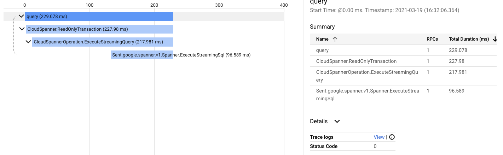

# Demo - Cloud Spanner With OpenCensus

## About Cloud Spanner

[Cloud Spanner](https://cloud.google.com/spanner/) is a fully managed, mission-critical, 
relational database service that offers transactional consistency at global scale, 
schemas, SQL (ANSI 2011 with extensions), and automatic, synchronous replication 
for high availability.

Be sure to activate the Cloud Spanner API on the Developer's Console to
use Cloud Spanner from your project.

See the [Spanner client lib docs](https://googleapis.dev/java/google-cloud-clients/latest/index.html?com/google/cloud/spanner/package-summary.html) to learn how to
interact with Cloud Spanner using this Client Library.

## About OpenCensus

OpenCensus is a set of libraries for various languages that allow you to collect
application metrics and distributed traces, then transfer the data to a backend
of your choice in real time. This data can be analyzed by developers and admins 
to understand the health of the application and debug problems.

Read more [here](https://opencensus.io/).

### Running Sample App (Standalone/Locally)
Instructions for setting up an end-to-end demo environment locally.

### 1. Set up Cloud Spanner with the Expected Schema

Create a database with the following schema:

```
CREATE TABLE person (
	id STRING(MAX),
	name STRING(MAX),
	email STRING(MAX),
) PRIMARY KEY (id);
```
Make note of your instance ID, and database name.

### 2. Set Up Your Environment and Auth

Follow the [set up instructions](https://cloud.google.com/spanner/docs/getting-started/set-up) in the Cloud Spanner documentation to set up your environment and authentication. When not running on a GCE VM, make sure you run `gcloud auth application-default login`.

### 3. Specify Properties

In `PersonController.java`, specify your instance ID, database name and table name.
```
  String instanceId = "sample-instance";
  String databaseId = "sample-database";
  String table = "person";
```

### 4. To build the example
```bash
$ mvn clean package
```

### 5.  To Run the example
```bash
$ mvn exec:java -Dexec.mainClass=com.sample.spanner.App
```

Available endpoints:

 - For read request:  http://localhost:8080/spanner/read 
 - For query request:  http://localhost:8080/spanner/query

### Running Sample App on Kubernetes
Instructions for setting up an end-to-end demo environment on Kubernetes.

### 1. Build & Push Docker image

```
$ docker build -t spanner-census-gke:v1 .
$ docker tag spanner-census-gke:v1 gcr.io/<gcp_project>/spanner-census-gke:v1
$ docker push gcr.io/<gcp_project>/spanner-census-gke:v1
```

### 2. Deploy on cluster

Update `<image_path>` in `kube.yaml` to pick up the newly uploaded image from
Container Registry.

Apply the sample YAML file:
```
$ kubectl apply -f kube.yaml
```

## Viewing your traces in Cloud Trace

With the above you should now be able to navigate to the Stackdriver UI to see the traces.

which will produce such a screenshot:

### 1. Sample Query Trace


### 1. Sample Read Trace


Please visit https://console.cloud.google.com/traces/traces

## Viewing your metrics in Cloud Monitoring

[See](https://github.com/census-instrumentation/opencensus-specs/blob/master/stats/gRPC.md#grpc-stats) for all gRPC related metrics.

### 1. grpc.io/client/roundtrip_latency

This shows time between first byte of request sent to last byte of response
received, or terminal error. in milliseconds.


### 2. grpc.io/client/started_rpcs

This shows total number of client RPCs ever opened, including those that have
not completed.


### 3. cloud.google.com/java/spanner/gfe_latency

This shows the length of time (in milliseconds) between Google's network
receives an RPC and reads back the first byte of the response.


Please visit https://console.cloud.google.com/monitoring

--------------------------------------------------------------------------------

> WARNING: Be careful before you set sampler value to always sample, especially in production environment. Trace data is often very large in size and is expensive to collect. This is why rather than collecting traces for every request(i.e. alwaysSample), downsampling is preferred.